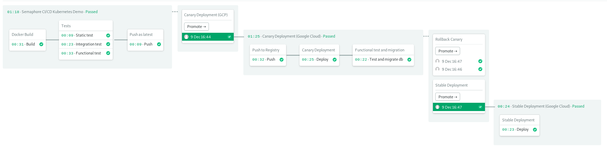

# semaphoredemo-cicd-kubernetes

A Companion Demo for the CI/CD with Docker and Kubernetes Book

## Run it in your workstation

```bash
$ docker-compose up --build
$ curl -w "\n" -X PUT -d "firstName=al&lastName=pacino" 127.0.0.1:3000/person
$ curl -w "\n" 127.0.0.1:3000/all
```


## CI/CD Pipelines

The CI/CD workflow is as follows:

1. Build docker image w/cache.
2. Run tests inside docker images.
3. Push image to docker registry.
4. Perform canary deployment.
5. Run functional test and migration in canary deployment.
6. One-click production/stable deployment.




### Configure Semaphore

1. Fork this repository
2. Clone it to your machine
3. Sign up for Semaphore and install [sem cli](https://docs.semaphoreci.com/article/53-sem-reference).
4. Add the project to Semaphore:

```bash
$ sem init
```

### Deploy to the cloud

Cloud services required:

- Kubernetes Cluster (recommended 3 nodes) called `semaphore-demo-cicd-kubernetes`
- PostgreSQL Database in the same region and VPC as the cluster.

Open the relevant pipeline files at `.semaphore` and fill in the environment variables for the blocks. 
Uncomment the desired promotion on `.semaphore/semaphore.yml`.

### Create Secrets

Create DB connection secret:

```bash
    $ sem create secret db-params \e
        -e DB_USER=YOUR_DB_USERNAME \
        -e DB_PASSWORD=YOUR_DB_PASSWORD \
        -e DB_HOST=YOUR_DB_IP \
        -e DB_PORT=YOUR_DB_PORT (5432) \
        -e DB_SCHEMA=YOUR_DB_SCHEMA (postgres) \
        -e DB_SSL=true|false (empty)
```


Depending on the cloud provider, you’ll need to create different secrets.

#### AWS

- Create an IAM User with Administrator permissions. Create a secret with the access id and the Kubernetes kubeconfig file:

```bash
$ sem create secret aws-key \
    -e AWS_ACCESS_KEY_ID=YOUR_AWS_ACCESS_ID \
    -e AWS_SECRET_ACCESS_KEY=YOUR_AWS_SECRET_KEY \
    -f YOUR_KUBECONFIG.yml:/home/semaphore/aws-key.yml
```

#### Google Cloud

- Create a project called `semaphore-demo-cicd-kubernetes`
- Create service account and generate a key file. Upload the file to Semaphore:

```bash
$ sem create secret gcp-key -f YOUR_KEY_FILE.json:/home/semaphore/gcp-key.json
```

#### DigitalOcean

- Create a project called `semaphore-demo-cicd-kubernetes` and set it as default.
- Get your authentication API Token and create a secret for it:

```bash
$ sem create secret do-key -e DO_ACCESS_TOKEN=YOUR_DIGITALOCEAN_TOKEN
```

- Set the parameter in `db-params` secret to `DB_SSL=true`

- Create a secret to store your DockerHub credentials:

```bash
$ sem create secret dockerhub \
    -e DOCKER_USERNAME=YOUR_DOCKERHUB_USER \
    -e DOCKRE_PASSWORD=YOUR_DOCKERHUB_PASSWORD
```

## License

Copyright (c) 2019 Rendered Text

Distributed under the MIT License. See the file [LICENSE.md](./LICENSE.md).


###  Setting Semaphore Project

---**** NOTES ****--
1. Docker Hub need it.
2. We want to push your local image to Docker Hub from any IDE or Docker Hub(Pending)
3. Get communication between IDE and DockerHub. you need a token to login on your local environment.
4. Environment variables must be constants, and global variables include in Personal Settings from Semaphore site
--> SEMAPHORE_REGISTRY_USERNAME = docker user name
--> SEMAPHORE_REGISTRY_PASSWORD = token must be created.
5. Replacing the name: demo with your name of the project
---****

-- BLOCK 1: Build
docker build

checkout
docker login -u $SEMAPHORE_REGISTRY_USERNAME -p $SEMAPHORE_REGISTRY_PASSWORD
docker pull $SEMAPHORE_REGISTRY_URL/semaphoredemo-cicd-kubernetes-web:latest
docker build --cache-from $SEMAPHORE_REGISTRY_URL/semaphoredemo-cicd-kubernetes-web:latest -t $SEMAPHORE_REGISTRY_URL/cicd_docker_kubernetes:$SEMAPHORE_WORKFLOW_ID .
docker push $SEMAPHORE_REGISTRY_URL/cicd_docker_kubernetes:$SEMAPHORE_WORKFLOW_ID


-- BLOCK 2: Test
Job Name: Unit test
docker run -it $SEMAPHORE_REGISTRY_URL/cicd_docker_kubernetes:$SEMAPHORE_WORKFLOW_ID npm run lint

Job Name: Functional test
sem-service start postgres
docker run --net=host -it $SEMAPHORE_REGISTRY_URL/cicd_docker_kubernetes:$SEMAPHORE_WORKFLOW_ID npm run ping
docker run --net=host -it $SEMAPHORE_REGISTRY_URL/cicd_docker_kubernetes:$SEMAPHORE_WORKFLOW_ID npm run migrate

Job Name: Integration test
sem-service start postgres
docker run --net=host -it $SEMAPHORE_REGISTRY_URL/cicd_docker_kubernetes:$SEMAPHORE_WORKFLOW_ID npm run test

Prologue
docker login -u $SEMAPHORE_REGISTRY_USERNAME -p $SEMAPHORE_REGISTRY_PASSWORD
docker pull $SEMAPHORE_REGISTRY_URL/cicd_docker_kubernetes:$SEMAPHORE_WORKFLOW_ID


-- BLOCK 3: Push
Job Name: Push
docker login -u $SEMAPHORE_REGISTRY_USERNAME -p $SEMAPHORE_REGISTRY_PASSWORD
docker pull $SEMAPHORE_REGISTRY_URL/cicd_docker_kubernetes:$SEMAPHORE_WORKFLOW_ID
docker tag $SEMAPHORE_REGISTRY_URL/cicd_docker_kubernetes:$SEMAPHORE_WORKFLOW_ID $SEMAPHORE_REGISTRY_URL/cicd_docker_kubernetes:latest
docker push $SEMAPHORE_REGISTRY_URL/cicd_docker_kubernetes:latest